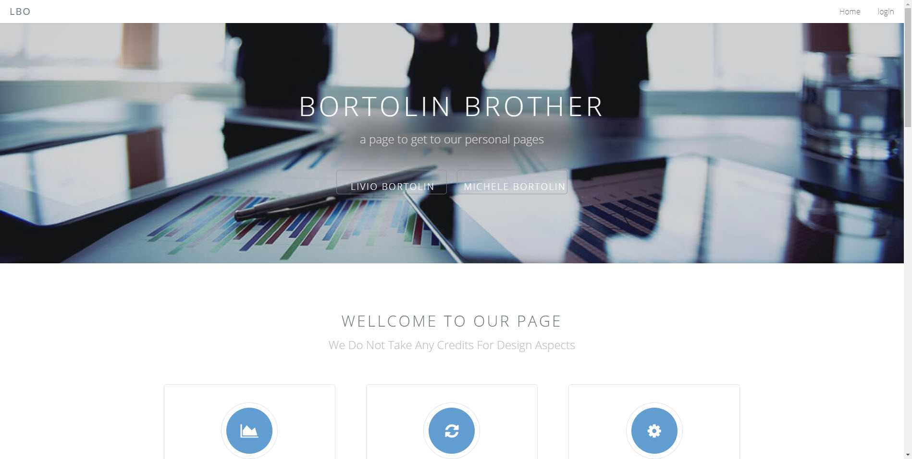
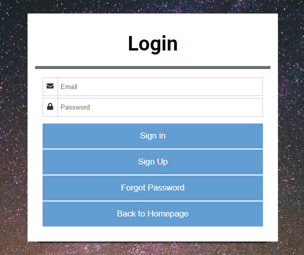

# MVC-webpage

This webpage should represent the landingpage for my main domain.

One should be able to click on a button to get redirected to my sub-domains.

## A webpage creation I did for a school project

The mainfocus of this project was to sort all web-file in MVC.

MVC is a design pattern used to decouple user-interface (view), data (model), and application logic (controller). 
This pattern helps to achieve separation of concerns.

## Features

On this page one can sign up with very own credential. 
These credentials will be hashed and stored on a integrated database.

After Login the "login" button changes to "logout".
When the user has Admin rights, it is possible to see all logins of this page.

In case a user forgets his credentials, one is able to reset the passwort.
A mail will be sent to the Email, the user used to login.

## Authors

Contributors names and contact info

Livio Bortolin  
[@LivioBortolin](https://www.linkedin.com/in/livio-bortolin-b62b8518a/)

## Version History

* 0.5
    * sorting files in MVC
* 0.4
    * add database  
* 0.3
    * add login/restPW/sign Up pages
* 0.2
    * adding files and changing them
* 0.1
    * Initial Release

## License

This project is licensed under the Bortol.in License - see the LICENSE.md file for details

## Acknowledgments

* [freeTemplate](https://www.free-css.com/free-css-templates)